# 06/07/2026

## AUTHENTICATION

Today, I studied authentication in Kubernetes during my CKS class.

The instructor explained the differences between **Users**, **Group**, and **ServiceAccounts**.

- **Users** and **Groups** are used for human users.
- **Service Accounts** are used by applications, bots, and services running inside the cluster.

### Create a ServiceAccount:

To create a ServiceAccount:

```bash
kubectl create sa dash-sa
```

Then, create a token for the ServiceAccount:

```bash
kubectl create token dash-sa --duration=2h
```

### Important Notes

- ServiceAccounts help imporve the security of a kubernetes cluster.
- Every Pod is create with the **default ServiceAccount** unless another one specified.
- To use a specific ServiceAccount, add the `serviceAccountName` field to the Pod manifest.

# 07/07/2026

## Lab ServiceAccount

Today, I practiced creating a ServiceAccount and associationg it with a Deployment.

- Deployment
  In deploy manifest I configured:
  `serviceAccountName: dash-sa`
  `automountServiceAccountToken: false`

  Disabling `automountServiceAccountToken: false` is an important security practice because it prevents Kubernetes from automatically mounting the ServiceAccount token into the Pod.

  I also configured a **projected volume** to mount the serviceAccount token only when I was required.
  The token is available at the following path: `/var/run/secrets/kubernetes.io/serviceaccount`

- Service Account
  In serviceAccount manifest I also configured:
  `automountServiceAccountToken: false`

  This disables automatic token mounting by default for any Pod that uses this ServiceAccount

### Conclusion

ServiceAccount are essential for authentication between applications and the Kubernetes API.
However, they must be configured carefully to avoid exposing credential or granting unnecessary permissions to Pods. Following the principle of least privilege helps improve the security of the Kubernetes cluster.

# 08/07/2026

## TLS Certificates

Today, I learned about TLS certificates and how the use asymmetric cryptography to secure communication between a client and a server.

The most important concept is asymmetric keys:

- The server owns a private key, witch must never be shared.
- The server also providate a public key, witch clients can use to encrypt data.

### Why is this important?

TLS encrypts the communication between the client and the server. Since only the server has the private key, only it can decrypt the encrypted information. This helps protect sensitive data from being intercepted during transmission.

Always remember to validate the Certificate Authority (CA).

### Generating a Private and Public Key

- Generate a private key:
  `openssl genrsa -out my-bank.key 1024`

- Generate a corresponding public key:
  `openssl rsa -in my-bank.key -pubout > my-bank.pem`

- public key extension:

* server.crt
* server.pem
* client.crt
* client.pem

- private key extension:

* server.key
* server-key.pem
* client.key
* client.key.pem

### Conclusion

TLS certificates are essential for securing communication over a network. By using asymmetric cryptography, they ensure that sensitive information is transmitted securely and remains protected from unauthorized access.

# 09/07/2026

## TLS in Kubernetes

Today, I learned about TLS in Kubernetes.
The instructor demonstrated how to create private keys and TLS certificates using `openssl`.
These certificates are essential because the encrypt communication between Kubernetes components, ensuring that data is transmitted securely.

I also learned about the **Certificate Authority (CA)**, witch is responsible for singing and validating certificates.
Users and administrators can use the CA on their local machines to generate and verify certificates.

Another important concept is that communication between components is secured through the **Kubernetes API Server**, witch uses TLS certificates to authenticate clients and encrypt all traffic.

### Commands

**Client Certificates for Clients and Server Certificates for Servers**
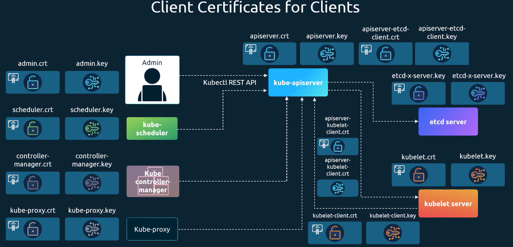

**Certificates Groups**
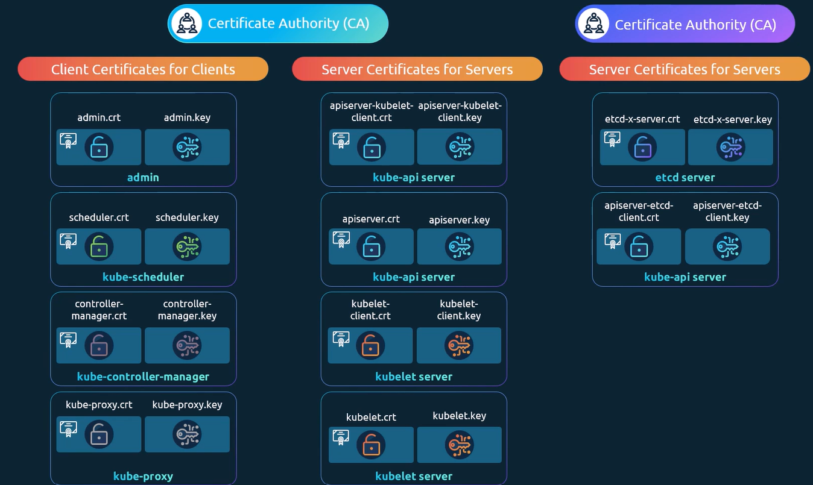

### Generate Certificates

- Certificate Authority (CA)
  **Commands:**
  Generate Keys: `openssl genrsa -out ca.key 2048`
  Certificate Signing Request: `openssl req -new -key ca.key -subj "/CN=KUBERNETES-CA" -out ca.csr`
  Sign Certificates: `openssl x509 -req -in ca.csr -signkey ca.key -out ca.crt`

- Admin User
  **Commands:**
  Generate Keys: `openssl genrsa -out admin.key 2048`
  Certificate Signing Request: `openssl req -new -key admin.key -subj "/CN=kube-admin" -out admin.csr`
  Sign Certificates: `openssl x509 -req -in admin.csr -signkey admin.key -out admin.crt`

  Certificate Signin Request With Group Permission:

  ```bash
  openssl req -new -key admin.key -subj \
      "/CN=kube-admin/OU=system:masters" -out admin.csr
  ```

- API Request

  ```bash
  curl https://kube-apiserver:6443/api/v1/pods \
    --key admin.key --cert admin.crt
    --cacert ca.crt
  ```

- Check logs
  `journal -u etcd.service -l`
  `crictl ps -a`
  `crictl logs 8753`

### Conclusion

TLS certificates are a fundamental part of Kubernetes security.
They provide authentication, encryption, and trust between components, ensuring that all communication within the cluster is secure.

# 10/07/2026

## Lab - View Certificates

### Commands:

Today's class was very good. I learned how to inspect Kubernetes cerficates.
For the CKS exam, I should pay attention to the certificate path, the Common Name (CN), and Validity fields.

- Validity: `openssl x509 -in ca.crt -text -nout | grep -i "Validity" -A 4`
- CN: `openssl x509 -in ca.crt -text -nout | grep -i "CN"`

### Conclusion

Undertanding Kubernetes certificates is essential for securing communication between cluster components. During the CKS exam, I should be able to locate certificates, inspect their details, verify the Common Name (CN), and check whether they are valid or expired.

# 13/07/2026

## Certificates API - Certificate Signing Request (CSR)

Today, I studied CSR in Kubernetes.

A CSR can be used to authenticate a user with the Kubernetes API Server by requesting a signed client certificate.
This is a secure authentication mechanism ad is commonly use to provide temporary or controlled access to a cluster.

The CSR workflow is straightforward:

1. Generate a prive key using openssl.
2. Create a CSR (.csr) using the private key.
3. Encode the CSR in Base64 and create a Kubernetes `CertificateSigningRequest` resource.
4. Approve the CSR.
5. Retrieve the signed certificate and use it together with the private key to authenticate to the Kubernetes API.

### Important Notes

- A CSR is **not** an administrator by default.
- The signed certificate only identifies the user (for example, through the Common Name and Organization fields).
- The user's permissions are determined by **RBAC** (Roles and Rolebindings), not by the certificate itself.
- A certificate becomes useful only after the CSR is approved and the appropriate RBAC permission are granted.

- Generate key and **csr** commands
  `openssl genrsa -out jane.key 2048`
  `openssl req -new -key jane.key -subj "/CN=jane" -out jane.csr`

- Using CSR
  `cat jane.csr | base64`

- Create CertificateSingingRequest

  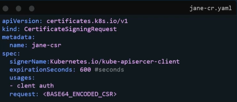

- Approve CSR
  `kubectl certificate approve jane`

### Conclusion

CSR provide a secure way to authenticate users with Kubernetes using client certificate. Understanding how to generate, approve, and use CSRs is essential for the CKS exam because it demonstrates knowledge of Kubernetes authentication and certificate management.

# 16/07/2026

## Labs - Certificates API

In this lecture, I learned how to create, approve, deny and delete CSR in Kubernetes.
Today's class was completely practical.
I created a Certificate Signing Request (CSR), approved it, denied another CSR, and deleted a CSR that had been created automatically.
I did not approve that certificate because it was part of the exercise.

### Commands Used

- `cat axely.csr | base64 | tr -d "/n"`
- `k get csr`
- `k apply new-csr.yaml`
- `k certificate approve new-csr`
- `k certificate deny agent-smith`
- `k delete csr agent-smith`

### Conclusion

Today's hands-on lab helped me understand how to manage Certificate Signing Requests (CSRs) in Kubernetes.
I learned that it is essential to carefully review a CSR before approving it.
An attacker could submit a malicious certificate request to gain unauthorized access to the cluster.
Therefore, administrators must always validate the CSR's details, such as the Common Name (CN), organization, and intended purpose, before approving it.

# 17/07/2026

## KubeConfig

In today's class, I learned how to use client certificates to connect to the Kubernetes API Server using `curl` or `kubectl`.

There are two ways authenticate using client certificates.
The first is to provide the certificate and private key directly using parameters such as `--cer`t and `--key`
The second option, which is the remommended approach, it to configure the client certificate and key in a `kubeconfig` file and use it with `kubectl`

- Request kubernetes API, using certificate directly:

**CURL**

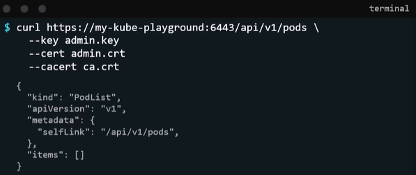

**KUBECTL**

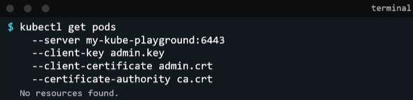

- Request Kubernetes API, using kubeConfig:

**KUBECONFIG**

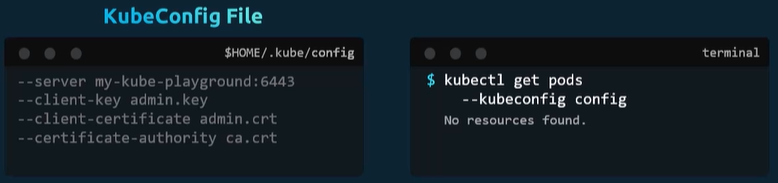

- KubeConfig, three sessions

  - Clusters
  - Contexts
  - Users

  **KubeConfig Example**
  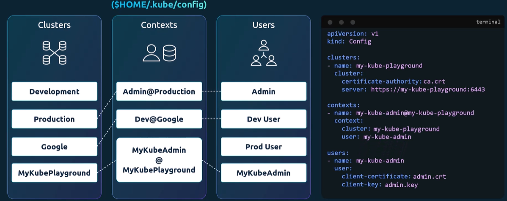

  **KubeConfig Example multiple namespaces**
  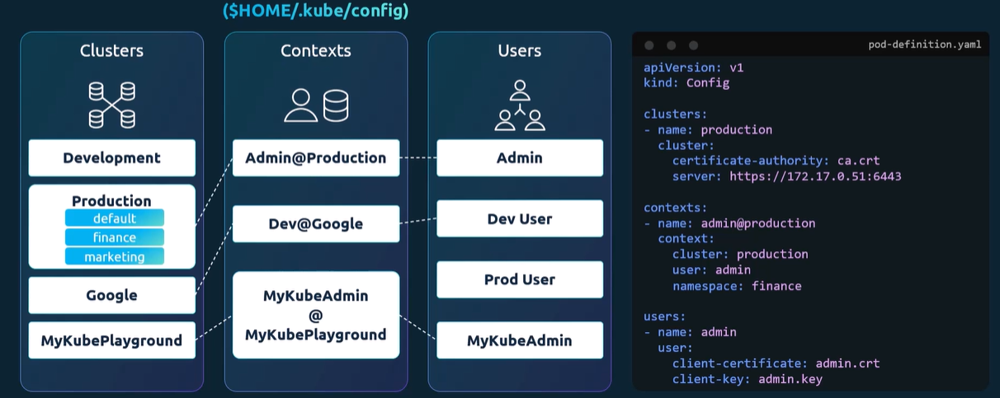

- Commands

  - kubectl config view
  - kubectl config view --kubeconfig=my-custom-config
  - kubectl config use-context prod-user@production
  - kubectl config -h

### Conclusion

Client certificates provide a secure way to authenticate users when connecting to the Kubernetes API Server.
Although certificates can be provided directly through command-line parameters, using a `kubeconfig` file is generally more convenient for managin Kubernetes access.

# 20/07/2026

## Labs - KubeConfig

Today, I learned how to configure the **kubeconfig** file.

The kubeconfig file is essential for running `kubectl` commands because it stores the information required to connect to Kubernetes clusters. It defines **clusters**, **users**, and **contexts**, allowing the client to authenticatew and communicate securely with the Kubernetes API Server.

I also learned that client certificates can be configured in the kubeconfig file to authenticate users with Kubernetes API Server, making it easier and more secure than specifying certificate files in every `kubectl` command.

### Commands kubeconfig

- `k config view`
- `k config get-clusters`
- `k config get-users`
- `k config get-contexts`
- `k config get-clusters --kubeconfig=my-kube-config`
- `k config get-contexts --kubeconfig=my-kube-config`
- `k config get-users --kubeconfig=my-kube-config`
- `export KUBECONFIG=~/my-kube-config`
- `source ~/.bashrc`

### Conclusion

The kubeconfig file is a fundamental component of Kubernetes. It provides a secure and convenient way for clients to connect to the Kubernetes API Server by managing cluster information, user credential, and contexts in a single configuration file.

The kubeconfig is used to client connect in Kubernetes API Sever security.

# 27/07/2026

## API GROUPS

Today, I learned about **API Groups** in Kubernetes.

According to the instructor, Kubernetes organizes its API into categories:

- **Core API Group** (also called the Legacy API Group)
- **Named API Groups**

### Core API Group /api

The **Core API Group** contains the original Kubernetes resources and does not have a group name in its API path (`/api/v1`).

Examples include:

- Pods
- Namespaces
- Nodes
- Services
- etc

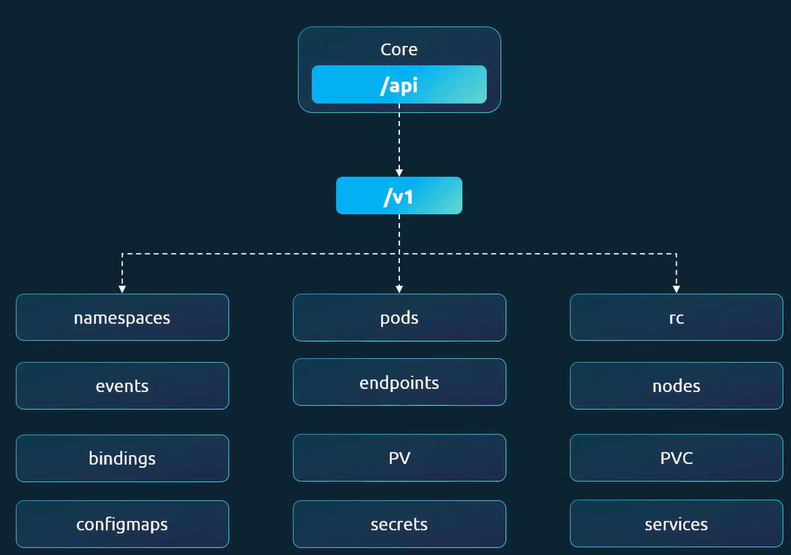

### Named API Groups /apis

**Named API Groups** organize newer Kubernetes resources under specific group names (for example, `/apis/apps/v1`).

Examples include:

- Deployments (`apps/v1`)
- Replicasets (`apps/v1`)
- Ingress (`apps/v1`)
- etc

Named API Groups alse include **Custom Resource Definations (CRDs)**, which allow users and applications to extend Kubernetes with their own resource types.

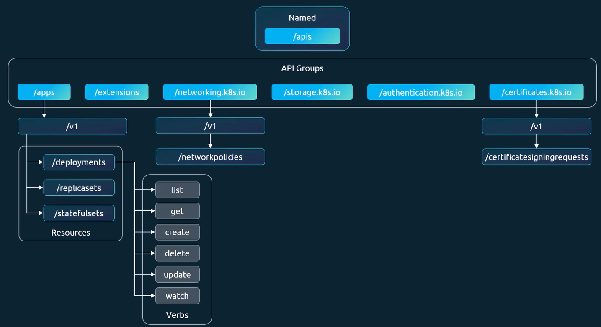

[API Versions - Documentations](https://kubernetes.io/docs/reference/kubernetes-api/group-versions/)

### Conclusion

Kubernetes is an API-driven platform. Every Kubernetes object is managed through its API.
Understanding the difference between the **Core API Group** and **Named API Groups** is important for the CKS exam because it help you identify where different resources belong and how Kubernetes organize its functionality.

# 29/07/2026

## Lab - Accessing API Server

- Access API Server using `kubectl proxy --port=8090`
- Request: `curl http://localhost:8090/api/`

- Access Kubernetes API without proxy: `curl -X GET $APISERVER/api --header "Authorization: Bearer $TOKEN" --insecure`

# 01/08/2026

## Lab - Retrieve Service Account token and use it to access API Server

1. Create a Service Account: `my-service-account`
2. Create a Secret: `my-service-account-token`
3. Associate the secret with the service account:

[Kubernetes Documentation](https://kubernetes.io/docs/tasks/configure-pod-container/configure-service-account/#manually-create-an-api-token-for-a-serviceaccount)

```yaml
apiVersion: v1
kind: ServiceAccount
metadata:
  name: my-service-account
  namespace: default
secrets:
  - name: my-service-account-token
---
apiVersion: v1
kind: Secret
metadata:
  name: my-service-account-token
  namespace: default
  annotations:
    kubernetes.io/service-account.name: "my-service-account"
type: kubernetes.io/service-account-token
```

4. Get secret token

```bash
kubectl get secret my-service-account-token -o jsonpath='{.data.token}' | base64 -d
```

5. Create role and rolebind

- **Role**

  Role name: `pod-reader`
  Namespace: `default`
  Rules:
  Resources: `pods`
  Verbs: `get, list, watch`

- **Role Binding**

  Role binding name: `read-pods`
  Namespace: `default`
  Subject: `ServiceAccount my-service-account in namespace default`
  RoleRef: `Role named pod-reader`

6. Request API Server using Token and CA certificate for SSL

- export TOKEN="..."
- export APISERVER="https://controlplane:6443"
- k config view --raw
- `kubectl config view --raw -o jsonpath='{.clusters[0].cluster.certificate-authority-data}' | base64 --decode > ca.crt`
- `curl --cacert ca.crt -H "Authorization: Bearer $TOKEN" "$APISERVER/api/v1/namespaces/default/pods"`

# 04/08/2026

## Authorization

- Authorization mode stay in Kubernetes API Server manifest:
  `--authorization-mode=Node,RBAC,Webhook`

- **Node:**
  A special-purpose authorization mode that grants permissions to kubelet based on the pods they are schedule to run. To learn more about the Node authorization mode, see:
  [Node Authorization](https://kubernetes.io/docs/reference/access-authn-authz/node/)

- **Webhook:**
  Kubernetes webhook mode for authorization makes a synchronous HTTP callout, blocking the request until the remote HTTP service responds to the query. You can write own software to handle the callout, or use solutions from the ecosystem.
  [Webhook](https://kubernetes.io/docs/reference/access-authn-authz/webhook/)

### RBAC

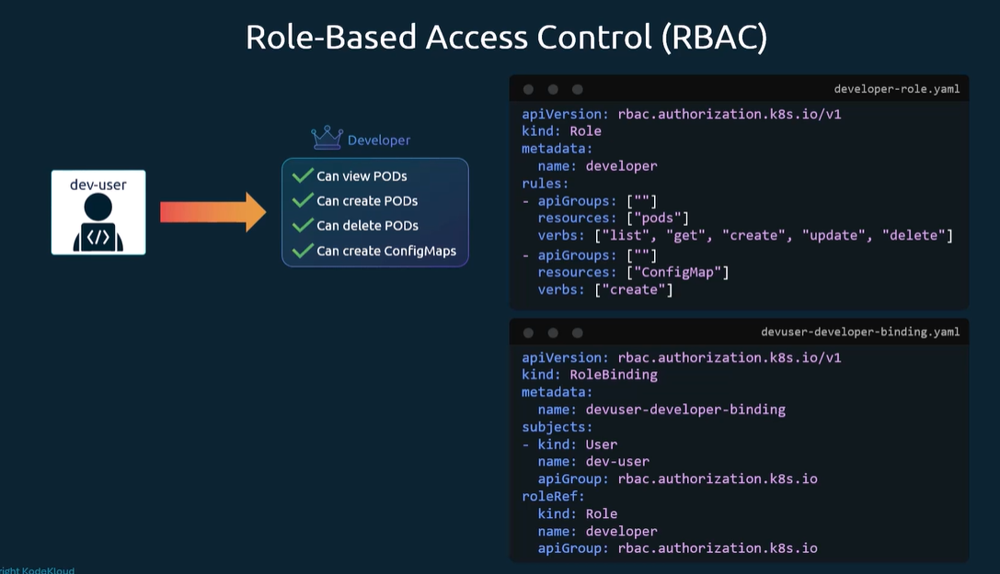

- **Check access**: `kubectl auth can-i create deployments`
- **Check access**: `kubectl auth can-i create deployments --as dev-user`
- **Check access**: `kubectl auth can-i create deployments --as dev-user --namespace test`

# 07/08/2026

## Cluster Roles and Cluster Role Bindings

ClusterRoles and clusterRoleBinding define permissions at the cluster level.
These permissions apply to cluster-scoped resources or can grant access across all namespace.

Examples of cluster-spcoped resources include:

- StorageClasses
- Persistent Volumes
- Nodes

- `k create clusterrole nodes-adm --verb=* --resource=nodes`
- `k create clusterrolebinding nodes-adm --clusterrole=nodes-adm --user=michelle`
- `k create clusterrole storage-adm --verb=* --resource=storageclasses --resource=persistentvolume`
- `k create clusterrolebinding storage-adm --clusterrole=storage-adm --user=michelle`

# 11/08/2026

## Kubelet Security

- `curl -sk https://localhost:10250/pods/ -key kubelet-key.pem -cert kubelet-cert.pem`

- kubelet config `/usr/local/bin/kubelet/` - Flag anonymous-auth=false

- Authentication: key and cert

- Authorization: Mode: AlwaysAllow, Webhook

# 12/08/2026

## Labs - Kubelet Security

What's kubelet config directory?
R: `/var/lib/kubelet/config.yaml`

- Authentication configuration

```yaml
apiVersion: kubelet.config.k8s.io/v1beta1
authentication:
  anonymous:
    enabled: true
  webhook:
    cacheTTL: 0s
    enabled: true
  x509:
    clientCAFile: /etc/kubernetes/pki/ca.crt
```

- Authorization configuration

```yaml
apiVersion: kubelet.config.k8s.io/v1beta1
authorization:
  mode: AlwaysAllow
```

- Kubelets ports
  **Full access port:** `10250`
  **Read-only access port:** `10255`

- Call the pods API using the command
  `curl -sk https://localhost:10250/pods`

- Restart kubelet
  `systemctl restart kubelet`
  `systemctl status kubelet`

- Set the authorization mode to `Webhook` and call the API again
  **Response:** `Forbidden (user=system:anonymous, verb=get, resource=nodes, subresource(s)=[pods proxy])`

- Disble anonymous authentication mode and check agin using API Command
  `curl -sk https://localhost:10250/pods`
  **Response:** `Unauthorized`

- Check metrics on readOnlyPort (10255)
  `curl -sk http://localhost:10255/metrics`

- Desable check the metrics API
  `readOnlyPort: 0`
  `curl -sk http://localhost:10255/metrics`

# 15/08/2026

Today, I studied Kubernetes Proxy and Port Forward.

## kubectl Proxy & Port Forward

### kubectl Proxy

We can use **kubectl proxy** to access **Kubernetes API Server** from our local machine.
When we run: `kubectl proxy`

`kubectl` uses the credentials and certificates configured in our kubeconfig file: `~/.kube/config`  
By default, the proxy listens on: `http://localhost:8001`  
For example, we can access the Kubernetes API through the proxy:
`http://localhost:8001/api/v1/namespaces`

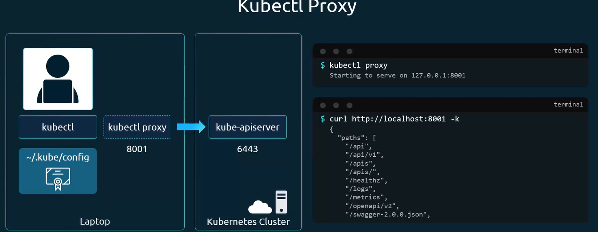

This is useful because `kubectl proxy` handles the authentication with the API Server for us.

### kubectl Port Forward

`kubectl port-forward` allows us to forward a port from our local machine to a **Pod**, **Service**, or **Deployment**
inside the cluster.  
For example:

`kubectl port-forward service/nginx 28080:80`

In this example:

- `28080` is the port on our **local machine.**
- `80` is the port associated with the resource inside the **cluster**

Then, we can access the application locally:

`http://localhost:28080`

### Labs - kubectl Proxy & Port Forward

Start proxy: `kubectl proxy --port=8001`

Call the API endpoint: `curl http://localhost:8001/version`

Summary for this lab:

`kubectl proxy` - Opens proxy port to API Server.
`kubectl port-forward` - Opens port to target deployment pods.

### Conclusion

`kubectl proxy` and `kubectl port-forward` have different purposes. **Kubectl proxy** provides local access to the Kubernetes API Server and uses the authentication information from kubeconfig file. **Port forwarding** provides temporary local access to an application or resource running inside the cluster without exposing it externally.

# 15/08/2026

## Verify Platform Binaries Before Deploying

Is very important when we did download binary kubernetes, verify shasum.

`curl https://dl.k8s.io/v1.20.0/kubernetes.tar.gz -L -o kubernetes.tar.gz`
`sha512sum kubernetes.tar.gz`

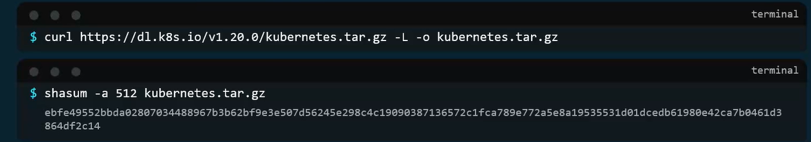

# 15/08/2026

## Kubernetes Releases

`kubeclt get nodes` - Verify VERSION

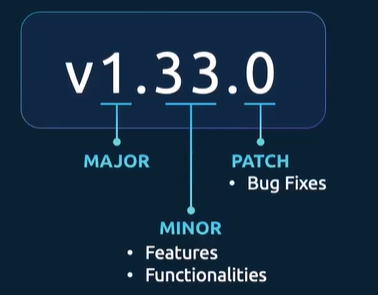

# 17/08/2026

## Cluster Upgrade Process

### kubeadm

In accordance to the instructor, the Kubernetes support only three last patch version. In addition, always is recomended to do upgrade to next version patch, never directly to version latest.

For example:

Recomended
1.10 -> 1.11

Not recomended:
1.10 -> 1.13

### kubeadm - help commands

First, upgrade mater node. After upgrade worker node.

- **apt-get upgrade -y kubeadm=1.12.0-00**
- `kubeadm upgrade plan`
- `kubeadm upgrade apply v1.12.0`
- `kubectl get nodes`
- **apt-get upgrade -y kubelet=1.12.0-00**
- **systemctl restart kubelet**
- `kubectl get nodes`

**Update worker nodes**

- `kubectl drain node-1`
- `kubectl uncordon node-1`

### Demo - Cluster Upgrade

- [Kubeadm upgrade](https://kubernetes.io/docs/tasks/administer-cluster/kubeadm/kubeadm-upgrade/)

1. Upgrading Kubeadm Clusters

2. Changing the package repository (Only verify)

   - Verify Ubuntu Distribution: `cat /etc/*release*` -> **PRETTY_NAME**

3. Replace the `apt` repository definition

   - Copy command: echo "deb [....]" -> Update minor version -> Execute inside the cluster
   - Second command, download key -> Update minor version -> Execute inside the cluster
   - **sudo apt update**
   - **sudo apt-cache madison kubeadm** -> Take the version. Ex: `1.29.3-1.1`

4. Upgrade kubeadm

   - Copy command and change to version disere

     ```bash
       sudo apt-mark unhold kubeadm && \
       sudo apt-get update && sudo apt-get install -y kubeadm='1.29.3-1.1' && \
       sudo apt-mark hold kubeadm
     ```

   - `kubeadm version`
   - `sudo kubeadm upgrade plan`
   - `kubeadm upgrade apply v1.29.3`
   - `kubectl get nodes` -> Still old version. Necessary update `kubectl`

5. Upgrade `kubelet` and `kubectl`

   - Drain node (Master) where is **kubectl**: `kubectl drain controlplane --ignore-daemonsets`
   - In documentation, copy the command, change version desere and apply inside the cluster:
     - `sudo apt-mar unhold kubelet kubectl && ....`
     - `sudo systemctl daemon-reload`
     - `sudo systemctl restart kubelet`

# 24/08/2026

In this lab, I learned how to upgrade kubernetes using kubeadm.

We can't forget: `k cordon <node-name>` and `k uncordon <node-name>`

# 25/08/2026

## Network Policy

In this lecture, the instructor taught us about Network Policy in Kubernetes.
By default, Kubernetes allows all network traffic between Pods.
This means that, without Network Policies, Pods can generally communicate with each other without network restrictions.

To enfforce NetworkPolicy, we need a CNI plugin that support them, such as Calico.
NetworkPolicy allow us to control ingress (incoming) and egress (outgoing) traffic between Pods and other network endpoint.

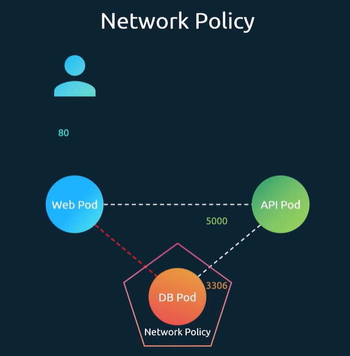

### Conclusion

By default, Kubernetes allows network traffic between the Pods.
When we use a CNI plugin such as Calico, we can create and enfforce NetworkPolicies to restrict this communication.

Applying NetworPolicies adds a additional security layer to the cluster by controlling which applications are allowed to communicate with each other.

# 25/08/2026 - 2
