# 05/09/2026

## Falco Overview and Installation

- Falco Architeture

  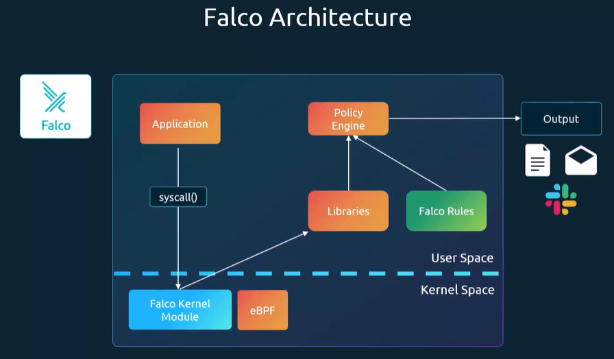

- Install as a Package

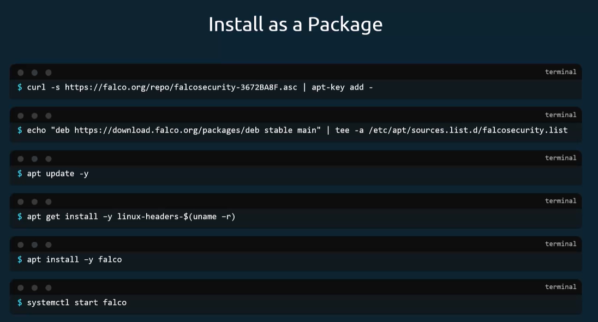

- Falco Install DaemonSet

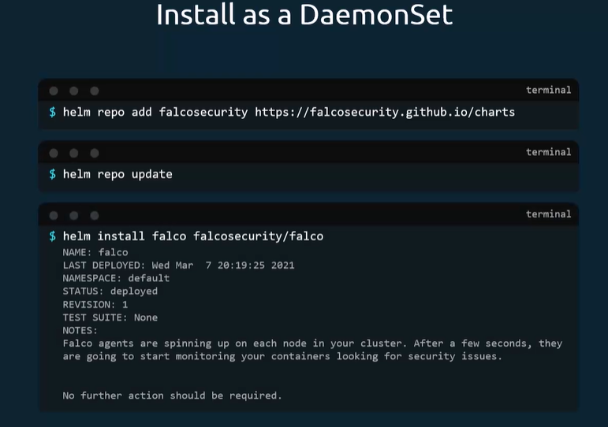

## Use Falco to Detect Threats

- `systemctl status falco`

- `journalctl -fu falco`

While I’m running Kubernetes commands, I can see the events in the output of `journalctl -fu falco`.

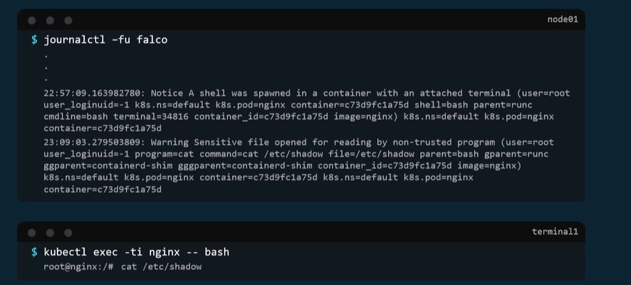

- Falco Rules Example

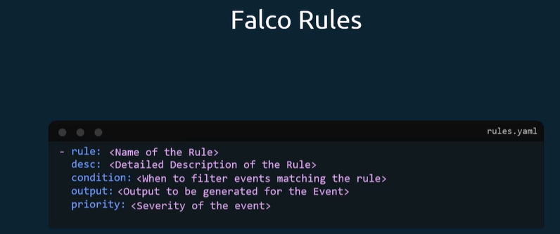

- Real Falco Rules

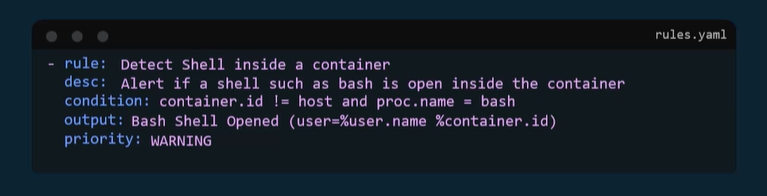

## Falco Configuration Files

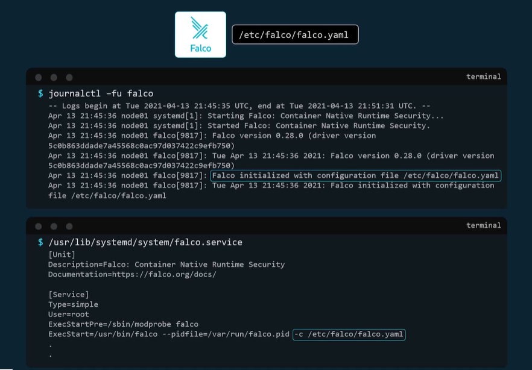

- Falco Yaml

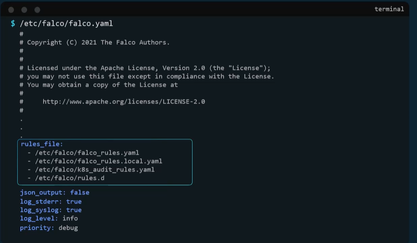

- Falco Output

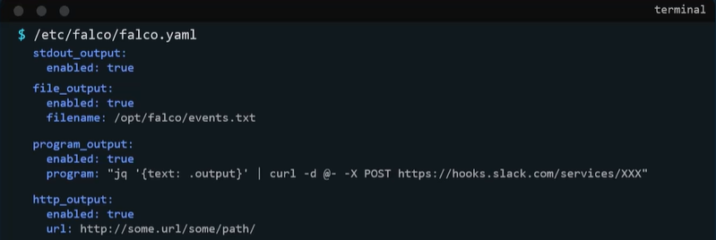

## Mutable vs Immutable Infrastructure

- Mutable -> Update cluster regurlarly

- Immultable -> Doesnt update cluster

## Ensure Immutability of Containers at Runtime

- FileSystem ReadOnly: true
- userRunNonPrivilegies: true

## Kubernets Auditing

- Audit Policy

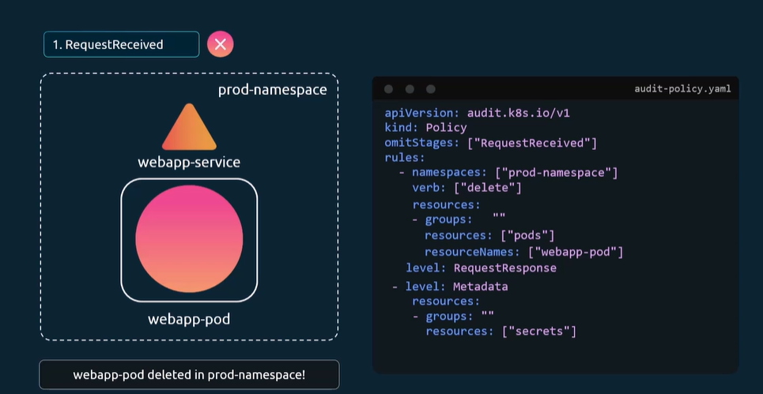

- Kube-apiserver config audit log

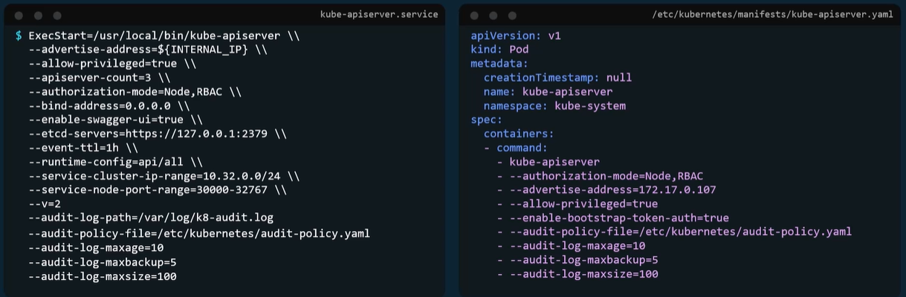
