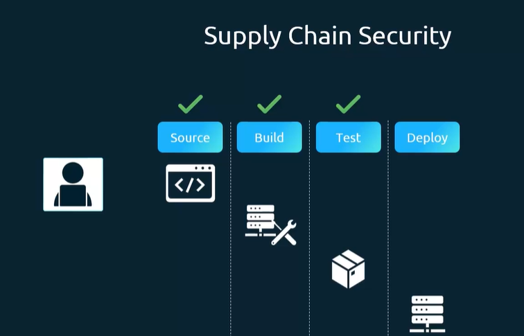
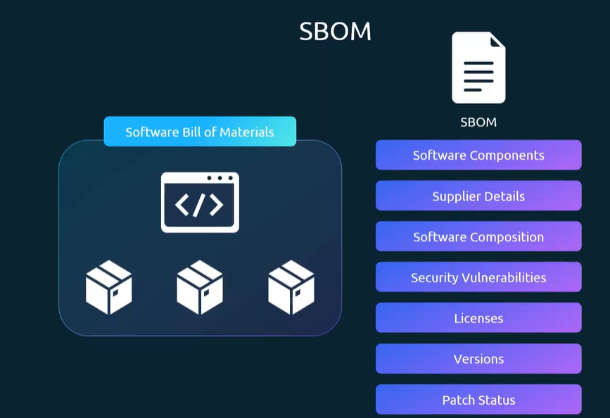
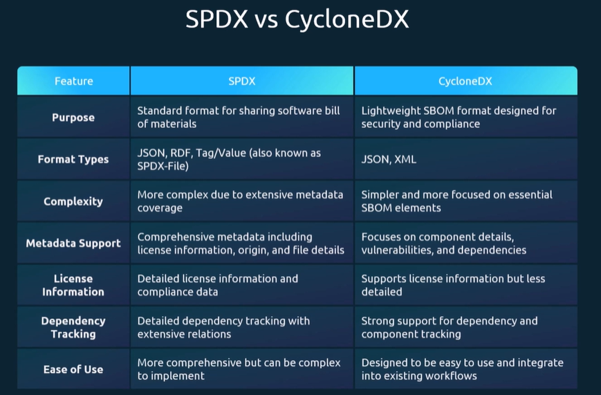
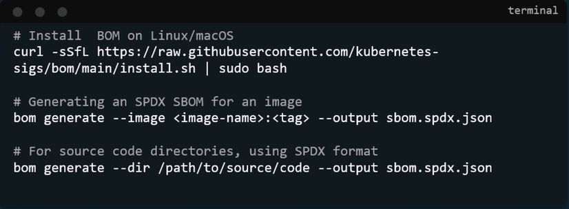
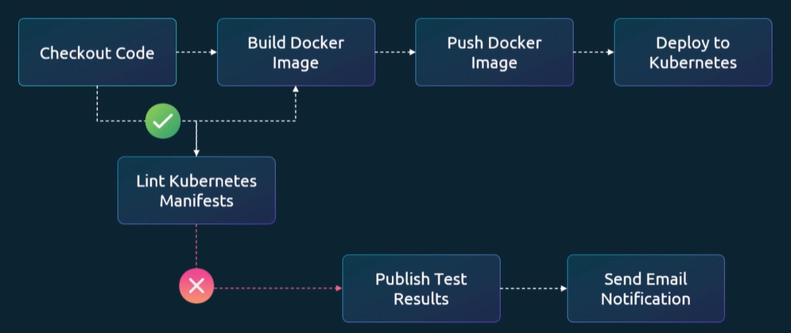
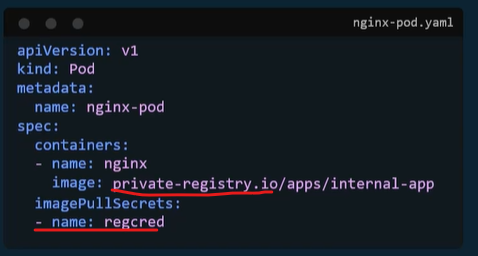
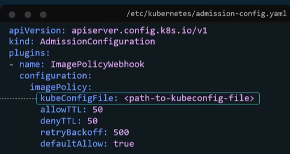
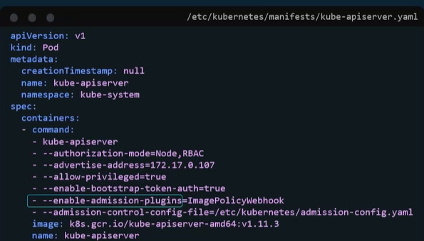
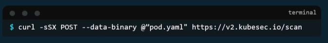
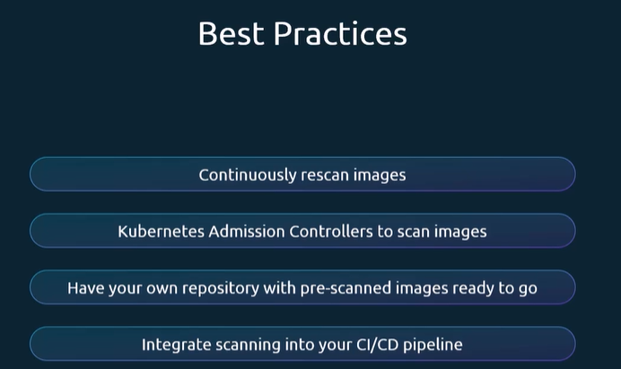

# 05/09/2026

## Overview of Supply Chain Security

- Detect vulnerabilities before deploying to the cluster.

  

## What is SBOM and Why It's Important



## Minimize Base Image Footprint

- Use minimal image
- Use stage build and runtime

## SBOM Format

### SPDX vs CycloneDX



## SBOM Workflow​



- Use grype to scan: `grype sbom:nginx-sbom.cyclonedx.json`

> An SBOM tells you what components you have

- An SBOM—Software Bill of Materials—is a detailed inventory of all software components used in an application.

- Think of it as the ingredient list on a food package, but for software.

  For example, imagine your Java application contains:

  ```
    payment-service
    ├── Spring Boot 3.5.0
    ├── Log4j 2.24.3
    ├── Jackson 2.19.0
    └── PostgreSQL Driver 42.7.5
  ```

The SBOM records information such as:

- Component name
- Version
- Supplier
- License
- Dependency relationships
- Package identifier

If a new vulnerability is discovered in Log4j 2.24.3, you can check your SBOM and
quickly determine whether your application uses that version.

A simple workflow is:

1. Build the application.
2. Generate the SBOM.
3. Scan its components for known vulnerabilities.
4. Block deployment if critical vulnerabilities are found.
5. Store the SBOM for audits and future analysis.

For example, you can generate an SBOM with Syft:

```bash
syft payment-service:1.0 -o cyclonedx-json > sbom.json
```

Then scan it with Grype:

```bash
grype sbom:sbom.json
```

A good summary is:

> **An SBOM tells you what components you have, while Dependency-Check and Mend tell you whether those components have known vulnerabilities.**

## Introduction to KubeLinter



**KubeLinter** is a static analysis tool that checks Kubernetes YAML manifests and Helm charts for insecure configurations and violations of recommended practices—usually before deployment.

Think of it as a Kubernetes configuration reviewer.

For example, consider this Deployment:

```yaml
apiVersion: apps/v1
kind: Deployment
metadata:
  name: nginx
spec:
  template:
    spec:
      containers:
        - name: nginx
          image: nginx:latest
```

KubeLinter may identify problems such as:

- The image uses the mutable latest tag.
- CPU and memory limits are missing.
- The container may run as root.
- No readiness probe is configured.

Run it with:

```bash
kube-linter lint deployment.yaml
```

A safer configuration might include:

```yaml
containers:
  - name: nginx
    image: nginx:1.27.4
    resources:
      requests:
        cpu: 100m
        memory: 128Mi
      limits:
        cpu: 500m
        memory: 256Mi
    securityContext:
      runAsNonRoot: true
      allowPrivilegeEscalation: false
```

## Image Security

- We always must use private registry



## Whitelist Allowed Registries - Image Policy Webhook

Image Admission configuration:



Kube-apiserver configuration



## Use Static Analysis of User Workloads

**kubesec:**

`kubesec scan pod.yaml`

or via curl



## Scan images for known vulnerabilities (Trivy)

- Common Vulnerabilities and Exposure (CVE)

- The best practices:



**Trivy** is an open-source security scanner created by Aqua Security.
It can scan container images, repositories, filesystems, Kubernetes clusters, and SBOMs. It detects known vulnerabilities, insecure configurations, exposed secrets, and license problems.

Simple example

Suppose you built this container image:

```bash
docker build -t payment-service:1.0 .
```

Scan it with:

```bash
trivy image payment-service:1.0
```

Trivy may produce findings like:

```
Library       Vulnerability    Severity    Installed    Fixed Version
openssl       CVE-XXXX-1234    CRITICAL    1.1.1        1.1.2
curl          CVE-XXXX-5678    HIGH        7.70.0       7.81.0
```

This means your image contains vulnerable versions of openssl and curl.

To show only serious vulnerabilities:

```bash
trivy image --severity HIGH,CRITICAL payment-service:1.0
```

To fail a CI/CD pipeline when serious vulnerabilities are found:

```bash
trivy image \
  --severity HIGH,CRITICAL \
  --exit-code 1 \
  payment-service:1.0
```

**Trivy versus KubeLinter**

| Tool           | What it primarily checks                                   | Example                                        |
| -------------- | ---------------------------------------------------------- | ---------------------------------------------- |
| **Trivy**      | Images, packages, dependencies, secrets and configurations | An image contains a vulnerable OpenSSL version |
| **KubeLinter** | Kubernetes YAML files and Helm charts                      | A container is allowed to run as root          |
| **SBOM**       | Lists components; it is not a scanner                      | The image contains OpenSSL 1.1.1               |

**Trivy can also generate an SBOM:**

```bash
trivy image \
  --format cyclonedx \
  --output sbom.json \
  payment-service:1.0
```

> **KubeLinter reviews your Kubernetes configuration. Trivy searches your artifacts and configurations for security problems. An SBOM lists what the software contains.**
