# 27/08/2026

## Least Privilege Principle

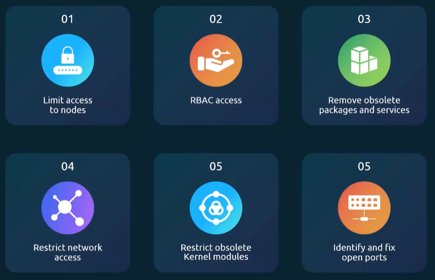

## Reducing the Attack Surface


## Limiting Node Access

- VPN Solution.

### Users

- `cat /etc/passwd`
- `cat /etc/group`

**0:** `user root`

**From 0 to 999:** `system users`

**From 1000:** `normal users`

### Set password to user

1. `sudo su`
2. `passwd david` -> Enter password.

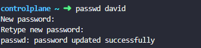

### Delete user and group

1. `userdel <user>`
2. `groupdel <group>`

### Disable user

1. `usermod -s /usr/sbin/nologin <user>`

### Create User with member admin group

1. `useradd -d <Directory-New-Account> -s <Login-shell-new-account> -G <group> -u <uuid> <name-new-user>`
2. `useradd -d /opt/sam -s /bin/bash -G admin -u 2328 sam`

### SSH Hardening

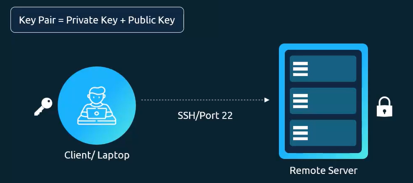

- `ssh-keygen -t rsa`

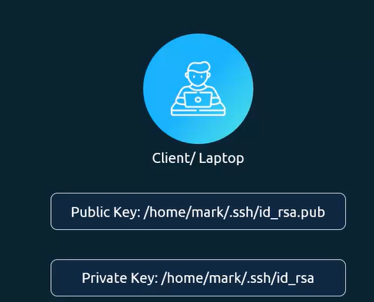

- `ssh-copy-id mark@node01`

**Hardening SSH Service**

- `vi /etc/ssh/sshd_config`
- `systemctl restart sshd`
- `systemctl reload sshd`

**SUDO**

- `cat /etc/sudoers`

### Lab - SSH Hardening and sudo

- Create user **jim:** node01~ `adduser jim`
- Return back to controlplane, and copy ssh public key
- controlplane~ `ssh-copy-id -i <identify-file> <destination>`
- controlplane~ `ssh-copy-id -i ~/.ssh/id_rsa.pub jim@node01`
- Test. controlplane~ `ssh jim@node01` -> ** jim@node01**

**Change the password of user jim**

1. `ssh node01`
2. `passwd jim`
3. Make **jim** with sudo user: `sudo vi /etc/sudoer`
4. **ADD:** `jim ALL=(ALL:ALL) ALL`
5. Change configuration to jim can to run sudo commands without entering the sudo password:
   **CHANGE**
   jim ALL=(ALL:ALL) ALL
   **TO**
   jim ALL=(ALL) NOPASSWD:ALL

**Create user rob**

1. `ssh node01`
2. `adduser rob` -> password
3. add in admin group: `usermod rob -G admin`

**Disable SSH root login**

1. `ssh node01`
2. `vi /etc/ssh/sshd_config`
3. Disable root login: `PermitRootLogin no`
4. Disable password authentication for ssh: `PasswordAuthentication no`
5. Restart sshd: `service sshd restart`

   **RESULT**
   `ssh node01`
   **_root@node01: Permission denied (publickey)._**

   `ssh jim@node01`
   **_Welcome to Ubuntu 22.04.5 LTS (GNU/Linux 6.8.0-1047-gcp x86_64)_**

# 28/08/2026

## Remove Obsolete Packages and Services

In a Kubernetes cluster, we should run only essential services.

If we find a inactive or unnecessary service, we should remove it to reduce the attack surface and improve the cluster security.

For example, if Apache is installed but not needed, we can remove it using:

`apt remove apache2`

**Key takeway:** Keep the Kubernetes nodes clean by removing unnecessary packages and services.
Fewer service mean fewer potential security vulnerabilities.

## Restrict Kernel Modules

- `modeprobe pcspkr`

- `lsmod`

- `cat /etc/modprobe.d/blacklist.conf`

## Identify and Disable Open Ports

- `systemctl status ssh`

- `netstat -an | grep -w LISTEN `

### Disabling Open Ports

- `cat /etc/services | grep -w 53`

## Lab - Identify open ports, remove packages services

- List all package installed: `apt list --installed`

- Check if python2.7 package is installed: `apt list --installed | grep python2.7`

- Command to be used to list only active service: `systemctl list-units --type service`

- Command can be used to list the kernel modules currently loaded on a system: `lsmod`

- Stop and remove nginx service: `systemctl stop nginx && rm /lib/systemd/system/nginx.service`

- We want to blacklist the evbug kernel module on controlplane: `vi /etc/modprobe.d/blacklist.conf` -> **blacklist evbug**

- Stoped service runing on 9090 port: `netstat -natp | grep 9090` -> `kill <process-id>`

- Please check for updates available for this package and update to the latest version available in the apt repos: `apt install wget -y`

## Minimize external access to the network

### Restricting Network Access

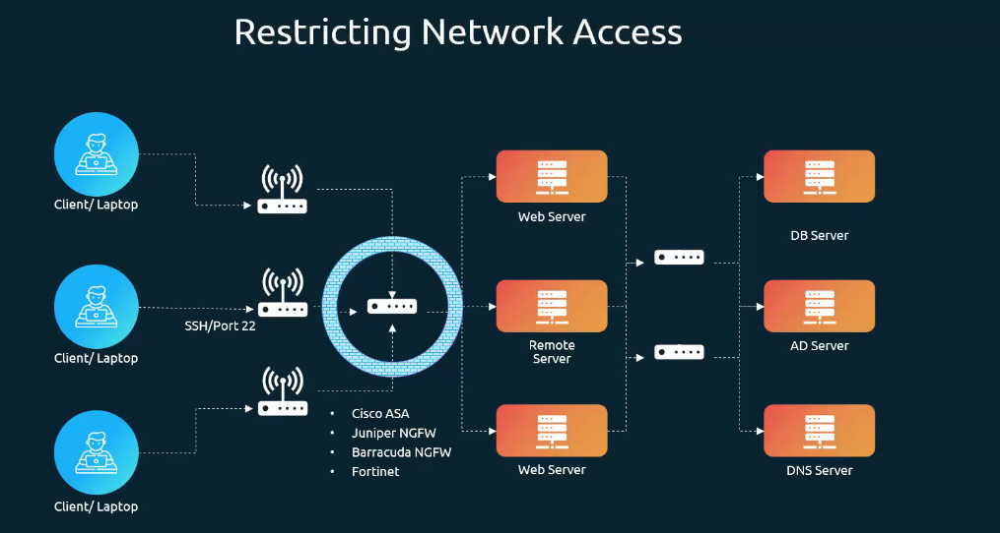

## UFW Firewall Basics

- `apt install ufw`

- `ufw status`

- `ufw default allow outgoing`

- `ufw default deny outgoing`

- `ufw allow from 172.16.238.5 to any port 22 proto tcp`

- `ufw allow from 172.16.238.5 to any port 80 proto tcp`

- `ufw allow from 172.16.100.0/28 to any port 80 proto tcp`

- `ufw deny 8080`

- `ufw enable`

- `ufw delete deny 8080`

## Labs - UFW Firewall

- commands can be used to display the rules along with rule numbers next to each rule: `ufw status numbered`

- command to allow a tcp port range between 1000 and 2000: `ufw allow 1000:2000/tcp`

- How can you reset ufw rules to their default settings? `ufw reset`

- On the node01 host, add a rule to allow incoming SSH connections: `ufw allow 22`

- ufw rules to allow incoming connection on these ports from IP range 135.22.65.0/24 to any interface:

  `ufw allow  from 135.22.65.0/24 to any port 9090 proto tcp`

  `ufw allow  from 135.22.65.0/24 to any port 9091 proto tcp`

  `ufw enable`

- There is a Lighttpd service running on the node01. Identify which port it is bound to: `netstat -natulp | grep lighttpd`

- disable the firewall but preserve all rules: `ufw disable`

## Linux Syscalls

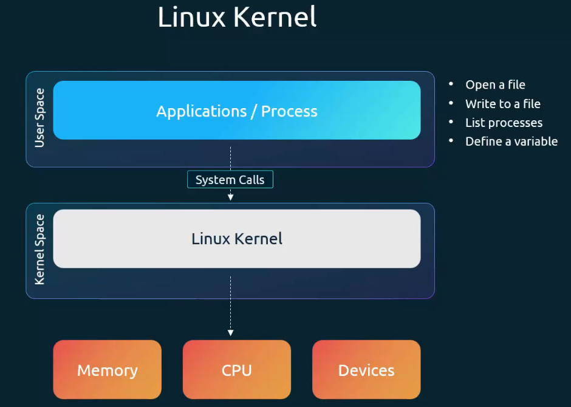

### Tracing syscall

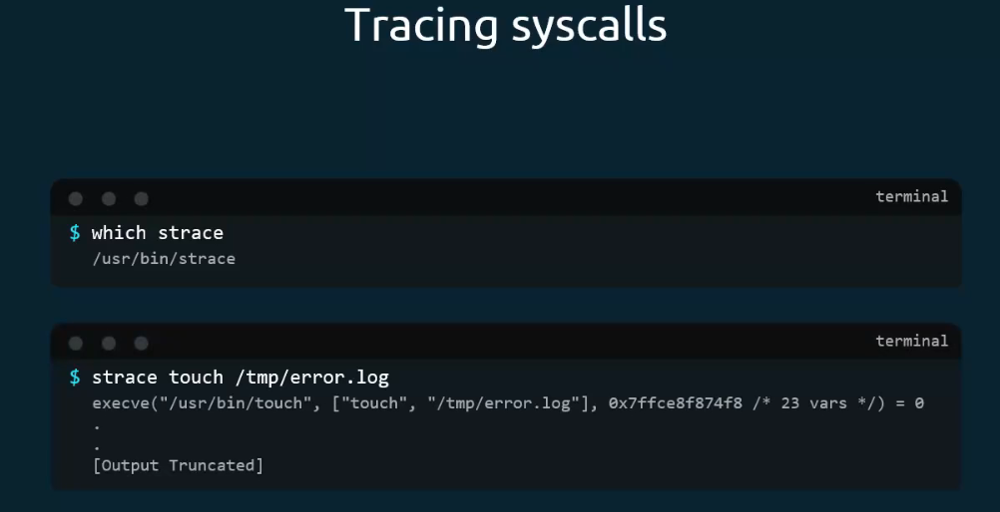

- `strace touch /tmp/error.log`

- `strace -c touch /tmp/error.log`

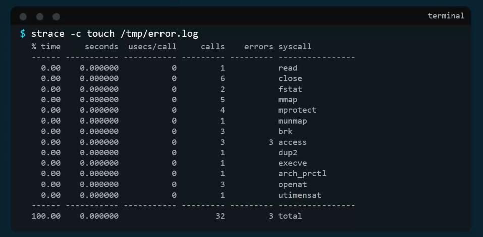

# 29/08/2026

## Restrict Syscalls Using Seccomp

**seccomp controls which Linux system calls a container can make.**

That process can interact with the Linux kernel.

For example:

```
nginx
  ↓
Linux System Calls
  ↓
Linux Kernel
  ↓
CPU / Memory / Files / Network
```

Containers provide isolation, but for security we want to apply the principle:

> **Give the container only the permissions it actually needs.**

**Syscall:**

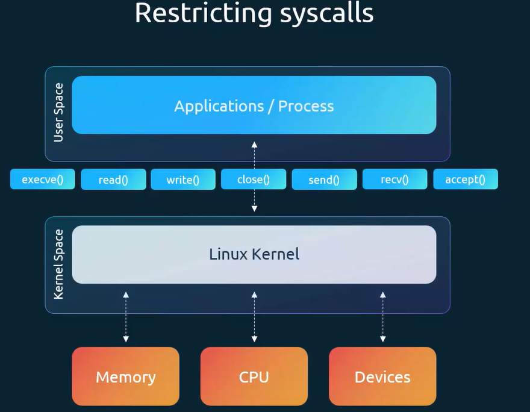

### What's seccomp?

**seccomp = Secure Computing Mode**

Its main goal is:

> **Restrict which system calls a process is allowed to make to the Linux kernel.**

A program doesn't directly tell the CPU:

> "Create a file."

Instead, it asks the Linux kernel through system calls (syscalls).

Examples include:

```
open()
read()
write()
mount()
reboot()
clone()
execve()
```

Think about the kernel as a hotel reception.

Your container asks:

```
Container → "Linux, please open this file."
Container → "Linux, please create a process."
Container → "Linux, please mount this filesystem."
```

These requests are **system calls**.

seccomp is like a security guard standing between the container and the Linux kernel:

```
                seccomp
                   ↓
Container → [ SECURITY ] → Linux Kernel
                   |
             Is this syscall
                allowed?
```

For example:

```
read()   → ✅
write()  → ✅
open()   → ✅
mount()  → ❌
reboot() → ❌
```

**Why is this useful?**

Imagine an attacker compromises your Nginx container.

Without restrictions, they may try to exploit dangerous kernel functionality.

With seccomp, you reduce the number of kernel operations available to the attacker.

This reduces the **attack surface**.

### Implement Seccomp in Kubernetes

`securityContext.seccompProfile`

```yaml
apiVersion: v1
kind: Pod
metadata:
  name: nginx
spec:
  containers:
    - name: nginx
      image: nginx
      securityContext:
        seccompProfile:
          type: RuntimeDefault
```

This tells Kubernetes:

> "Use the container runtime's default seccomp security profile."

The runtime blocks certain dangerous/unnecessary syscalls.

For CKS, RuntimeDefault **is usually the important profile to remember**.

```yaml
seccompProfile:
  type: Unconfined
```

That essentially means:

> Don't apply seccomp restrictions.

From a security perspective, you normally prefer:

```yaml
RuntimeDefault
```

Pod configuration:

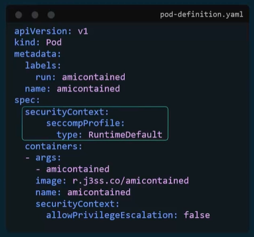

Exam Tip. Access documentation about seccomp: https://kubernetes.io/docs/tutorials/security/seccomp/

## Lab - Seccomp

- Command used to trace syscall: `strace` -> `strace touch -c /tmp/log.txt`

- Which syscall is NOT made by the command ls /root? **Para verificar, basta executar o comando: strace ls**. Por tanto, não é executado `connect`

- `kubectl logs -f -n tracee `kubectl get -n tracee pods -l app.kubernetes.io/name=tracee -o custom-columns=":metadata.name" --no-headers``

- Which was the last syscall that was generated by the container that ran the message echo hello? -> `pause`
  `kubectl logs -n tracee -l app.kubernetes.io/name=tracee | grep hello | grep syscall | tail -n1`

- What type of a profile is this? [seccomp](custom-profile.json)
  `whitelist white profile`

- "defaultAction": "SCMP_ACT_ALLOW" -> Allow All, except what is inside the syscall:[] -> [seccomp](relaxed-profile.json)

- What is the default Seccomp profile location in this cluster? `/lib/kubelet/seccomp`

## AppArmor

**AppArmor controls what a process/container can access and do on the Linux system.**

Its main goal is:

> **Control which resources and operations a program is allowed to access.**

For example:

```
Can nginx read /etc/nginx?
Can nginx write /var/log/nginx?
Can nginx execute /bin/bash?
Can nginx access /etc/shadow?
```

Imagine AppArmor as a security guard **inside a building**.

The container is allowed into the building, but AppArmor determines which rooms it can enter.

```
Container
   |
   ├── /etc/nginx       ✅
   ├── /var/log/nginx   ✅
   ├── /etc/shadow      ❌
   └── /root            ❌
```

### Simple AppArmor example

Suppose your application should be able to read:

`/data/*`

but should not be able to write there.

An AppArmor profile could contain rules conceptually like:

`/data/** r,`

Here:

```
r = read
w = write
x = execute
```

So:

```
read /data/file.txt
        ↓
       ✅

write /data/file.txt
        ↓
       ❌
```

- `apt-get install -y appamor-utils`

- `aa-status`

### AppArmor in Kubernetes

On supported Kubernetes/Linux setups, you can select an AppArmor profile through the container's `securityContext`, for example:

```yaml
apiVersion: v1
kind: Pod
metadata:
  name: nginx
spec:
  containers:
    - name: nginx
      image: nginx
      securityContext:
        appArmorProfile:
          type: RuntimeDefault
```

Or a custom profile already loaded on the node:

```
securityContext:
  appArmorProfile:
    type: Localhost
    localhostProfile: my-nginx-profile
```

- Pod configuration example:
  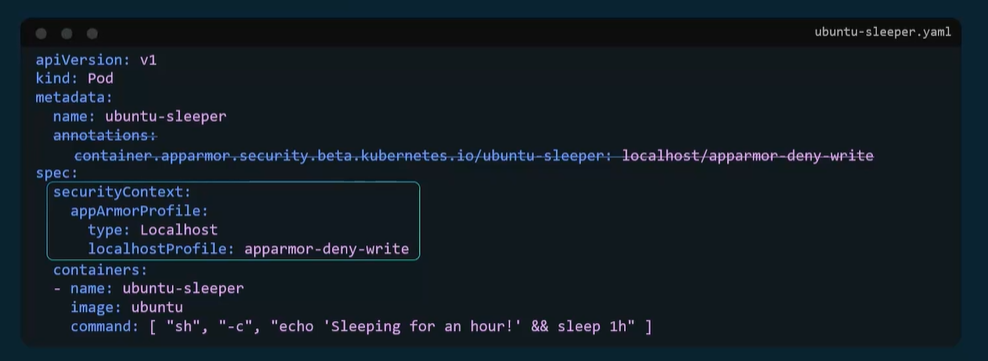

### The most important difference for CKS

This is what I recommend you memorize:

| Tool         | Controls                                    | Think about                    |
| ------------ | ------------------------------------------- | ------------------------------ |
| **seccomp**  | Linux system calls                          | **Kernel**                     |
| **AppArmor** | What resources/actions a process can access | **Files/resources/operations** |

So they complement each other:

```
                  CONTAINER
                      |
            ┌─────────┴─────────┐
            ↓                   ↓
         AppArmor            seccomp
            ↓                   ↓
     What can you access?    What syscalls
     What can you do?        can you make?
            ↓                   ↓
        Resources          Linux Kernel
```

### A real Kubernetes security example

```yaml
apiVersion: v1
kind: Pod
metadata:
  name: secure-nginx
spec:
  containers:
    - name: nginx
      image: nginx
      securityContext:
        runAsNonRoot: true

        allowPrivilegeEscalation: false

        capabilities:
          drop:
            - ALL

        seccompProfile:
          type: RuntimeDefault

        appArmorProfile:
          type: RuntimeDefault
```

Now you have several security layers:

```
runAsNonRoot
      ↓
Don't run as root

allowPrivilegeEscalation: false
      ↓
Don't allow the process to gain more privileges

capabilities.drop: ALL
      ↓
Remove Linux capabilities

seccomp
      ↓
Restrict system calls

AppArmor
      ↓
Restrict allowed operations/resources

```

## Lab AppArmor

**Repeat this labs:**

https://learn.kodekloud.com/learn/courses/certified-kubernetes-security-specialist-cks/module/d67be5ee-871d-4435-a187-382610cb6a1f/lesson/058cc5f9-4239-44ec-8021-e9201d4edc2b

- Load the AppArmor profile called custom-nginx on controlplane node and make sure that it is in enforced mode.
  The profile file is called `usr.sbin.nginx` located in the `default` AppArmor profiles directory.

  `apparmor_parser -q /etc/apparmor.d/usr.sbin.nginx`

  ```
  -q: quiet
  apparmor_parser [options] [profile]
  ```

  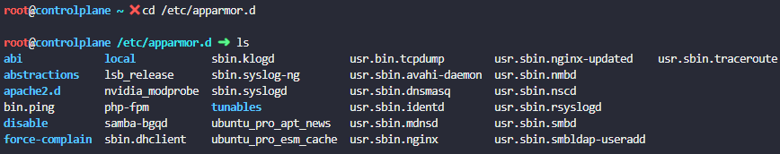
