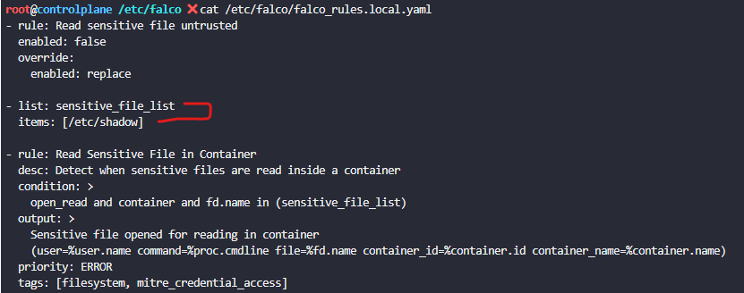

# Lab - Configuring Pod-to-Pod Encryption with Istio

Activate Istio mTLS?:

[PeerAuthentication](https://istio.io/latest/docs/reference/config/security/peer_authentication/)

```yaml
apiVersion: security.istio.io/v1
kind: PeerAuthentication
metadata:
  name: default
  namespace: istio-system
spec:
  mtls:
    mode: STRICT
```

Now, test communication between the Pods:

`k -n test exec -it test -- curl --head http://helloworld.default.svc.cluster.local:5000/hello`

Result:

```bash
curl: (56) Recv failure: Connection reset by peer
command terminated with exit code 56
```

We need to configure the test namespace with istio annotation injection:

`k label ns test istio-injection=enabled`

Now, execute the test again:

`k -n test exec -it test -- curl --head http://helloworld.default.svc.cluster.local:5000/hello`

Result:

```bash
HTTP/1.1 200 OK
server: envoy
date: Sun, 06 Sep 2026 11:40:52 GMT
content-type: text/html; charset=utf-8
content-length: 60
x-envoy-upstream-service-time: 49
```

# Lab - Implementing Tenant Isolation in a Kubernetes Cluster

- Add Taints: `k taint node node01 team=team-a:NoSchedule`
- Remove Taints: `k taint node node01 team=team-a:NoSchedule-`
- Pod Toleration: [Pod Tolerations](pod-a-toleration.yaml)

# Lab - Configuring Pod-to-Pod Encryption with Cilium

**Install Cilium usgin helm:**

## Step by step

- helm repo add cilium https://helm.cilium.io/

- helm install cilium cilium/cilium --version 1.20.1 \
   --namespace kube-system

- helm install cilium cilium/cilium \
  --namespace kube-system \
  --version 1.20.1\
  --set encryption.enabled=true \
  --set encryption.type=wireguard

## CKS TIPS:

helm show values → descobrir parâmetros
helm template/dry-run → validar antes de instalar
helm get values → conferir depois da instalação

**Template**

```bash
helm template cilium cilium/cilium \
  --version 1.18.0-pre.0 \
  --namespace kube-system \
  --set encryption.enabled=true \
  --set encryption.type=wireguard
```

**Dry-run debug**

```bash
helm install cilium cilium/cilium \
  --version 1.18.0-pre.0 \
  --namespace kube-system \
  --set encryption.enabled=true \
  --set encryption.type=wireguard \
  --dry-run \
  --debug
```

**Validate**

```bash
helm get values cilium \
  --namespace kube-system
```

**Validate all values**

```bash
helm get values cilium \
  --namespace kube-system \
  --all
```

**Alter value**

```bash
helm upgrade cilium cilium/cilium \
  --namespace kube-system \
  --version 1.20.1\
  --set encryption.enabled=true \
  --set encryption.type=wireguard

```

**Verify Intall Charts**

- `helm list --all-namespaces`

- `helm list -n kube-system`

- `helm status cilium -n kube-system`

- Install version: `helm list -n kube-system`

# Lab - Creating and Analyzing SBOMs

> Software Bill of Materials (SBOM)

Documentation: https://github.com/anchore/syft

1. Syft tool and move the binary to /usr/local/bin.
   `curl -sSfL https://raw.githubusercontent.com/anchore/syft/main/install.sh | sh -s -- -b /usr/local/bin`

2. Generate an SBOM for the docker.io/kodekloud/webapp-color:latest image in SPDX format
   `syft --help`

   `syft scan docker.io/kodekloud/webapp-color:latest -o spdx >> /root/webapp-spdx.sbom`

3. Generate an SBOM for the docker.io/kodekloud/webapp-color:latest image in CycloneDX JSON format
   `syft scan docker.io/kodekloud/webapp-color:latest -o cyclonedx-json  >> /root/webapp-sbom.json`

4. Download the Grype tool and move the binary to /usr/local/bin
   `curl -sSfL https://raw.githubusercontent.com/anchore/grype/refs/heads/main/install.sh | sh -s -- -b /usr/local/bin`

5. Analyze the /root/webapp-sbom.json SBOM using Grype
   `grype --help`
   `grype sbom:/root/webapp-sbom.json -o json >> /root/grype-report.json`

# Lab-Automating SBOM Generation in CI/CD

- https://github.com/alx0594/supply_chain_security/actions/runs/34119213099

# Lab - Performing Static Analysis with KubeLinter

1. curl -LO https://github.com/stackrox/kube-linter/releases/latest/download/kube-linter-linux.tar.gz

2. tar -xvf kube-linter-linux.tar.gz

3. mv kube-linter /usr/local/bin/

4. kube-linter --help

5. kube-linter lint /root/nginx.yml

# Labs - Image Security

- kubectl create secret docker-registry --help

- kubectl create secret docker-registry NAME --docker-username=user --docker-password=password --docker-email=email
  [--docker-server=string] [--from-file=[key=]source] [--dry-run=server|client|none] [options]

- k create secret docker-registry private-reg-cred --docker-username=dock_user \
  --docker-password=dock_password \
  --docker-server=myprivateregistry.com:5000 \
  --docker-email=dock_user@myprivateregistry.com

- Add in pod:
  ```yaml
  imagePullSecrets:
    - name: private-reg-cred
  ```

# Labs - Whitelist Allowed Registries - ImagePolicyWebhook

# Labs - kubesec

documentation: https://kubesec.io/

- What is the kubesec plugin used for?

  - `Scanning: Deployment, Pod, Replicaset, ...`

- Install kubesec:

  1. `curl -OL https://github.com/controlplaneio/kubesec/releases/download/v2.14.2/kubesec_linux_amd64.tar.gz`
  2. `tar -xvf kubesec_linux_amd64.tar.gz`
  3. `mv kubesec /usr/local/bin/`
  4. `kubesec --help`
  5. `kubesec scan node.yaml >> /root/kubesec_report.json`

# Labs - Trivy

- Install: https://github.com/aquasecurity/trivy **or the best:** https://trivy.dev/docs/latest/getting-started/installation/

  `curl -sfL https://raw.githubusercontent.com/aquasecurity/trivy/main/contrib/install.sh | sudo sh -s -- -b /usr/local/bin v0.74.0`

- `crictl pull public.ecr.aws/docker/library/python:3.12.4`

- `crictl img`

- `trivy image public.ecr.aws/docker/library/python:3.12.4`

**Filter**

### Filter by severities

- `trivy image --help`

**$ trivy image --severity HIGH,CRITICAL alpine:3.15**

- `trivy image --severity HIGH public.ecr.aws/docker/library/python:3.9-bullseye >> /root/python.txt`

### Container image from a tar archive

**$ trivy image --input ruby-3.1.tar**

- `trivy image --format json --input /root/alpine.tar >> /root/alpine.json`

# Labs - Use Falco to Detect Threats

- How can you check for the events generated by falco in this set up?
  `journalctl -fu falco-modern-bpf.service` _The -f flag here keeps the journal logs open for the falco service_

- `cat /etc/falco/falco.yaml`

- We just created a few new pods on this Kubernetes cluster. Identify the name of the pod that is running operations that falco considers to be suspicious.

  ```bash
  Sep 07 11:03:48 controlplane falco[8392]: 11:03:48.016072077: Error Sensitive file opened for reading in container (user=root command=cat /etc/shadow file=/etc/shadow container_id=c17ad03ccada container_name=simple-webapp-1) container_id=c17ad03ccada container_name=simple-webapp-1 container_image_repository=docker.io/library/busybox container_image_tag=latest k8s_pod_name=simple-webapp-1 k8s_ns_name=critical-apps
  ```

  - Pod name: **container_name**=simple-webapp-1 or **k8s_pod_name**=simple-webapp-1
  - Namespace: **k8s_ns_name**=critical-apps

- What is the name of the rule that triggered this output?

  **Search the rules inside `/etc/falco` directory as shown below:**

  `grep -ir 'Sensitive file opened for reading in container' /etc/falco/`

  **Result**

  **_/etc/falco/falco_rules.local.yaml: Sensitive file opened for reading in container_**

  **Therefore, the rule is in:** `/etc/falco/falco_rules.local.yaml`

  

# Labs - Ensure Immutability of Containers at Runtime

- Immutable:

  `k get pods -n alpha solaris -o yaml | grep -i readOnly`

  ```bash
   readOnlyRootFilesystem: true
   readOnly: true
   readOnly: true
   recursiveReadOnly: Disabled
  ```

- A stronger security configuration would be:

```yaml
securityContext:
  runAsNonRoot: true
  allowPrivilegeEscalation: false
  readOnlyRootFilesystem: true
  capabilities:
    drop:
      - ALL
```

- For the CKS exam, if the question asks you to ensure container immutability at runtime, look first for:

  `readOnlyRootFilesystem: true`

# Labs - Use Audit Logs to monitor access

https://kubernetes.io/docs/tasks/debug/debug-cluster/audit/

- Audit Logs is enabled?
  `cat /etc/kubernetes/manifests/kube-apiserver.yaml | grep audit`

- Which stage generates events when a request is complete?

`ResponseComplete
`

- Task 1 – Configure the kube-apiserver to enable auditing:

  Audit policy file: /etc/kubernetes/cluster-policy.yaml

  Audit log path: /var/log/cluster-audit.log

  Log retention: 10 days

  Maximum log size: 10 MB

  Maximum rotated files: 3

  Add the required flags, volumes, and volume mounts to the kube-apiserver static pod manifest. Wait for the API server to restart and confirm the log file is being created.

- Task 2 – Update the audit policy with the following rules (in order):

  None – health-check and non-resource URLs (/healthz*, /livez*, /readyz\*, /version, /metrics)
  None – watch and list verbs
  RequestResponse – Deployment changes (create, update, patch, delete) in the citadel namespace
  Metadata – secrets and configmaps
  Request – namespaces resource interactions
  Metadata – everything else (catch-all)

  Omit the RequestReceived stage.

  **Result: [Policy](cluster-policy.yaml)**
